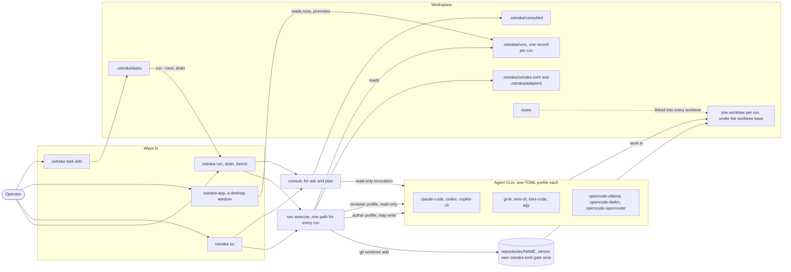
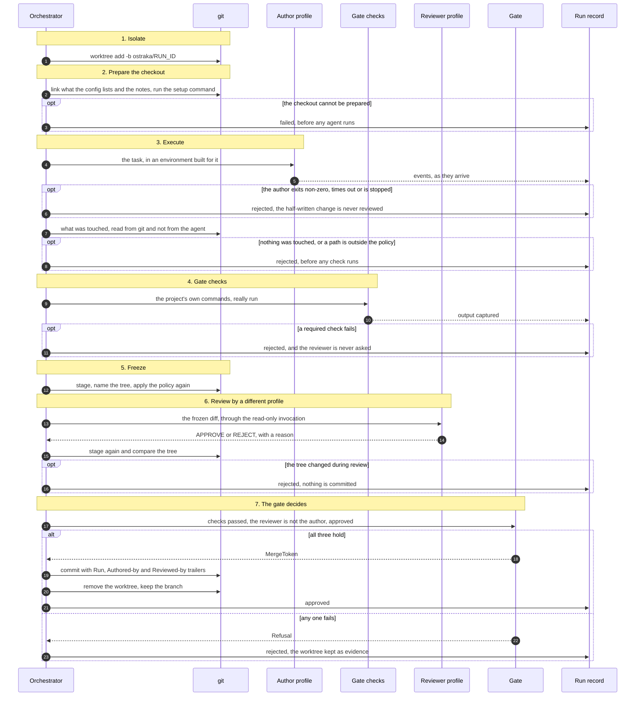
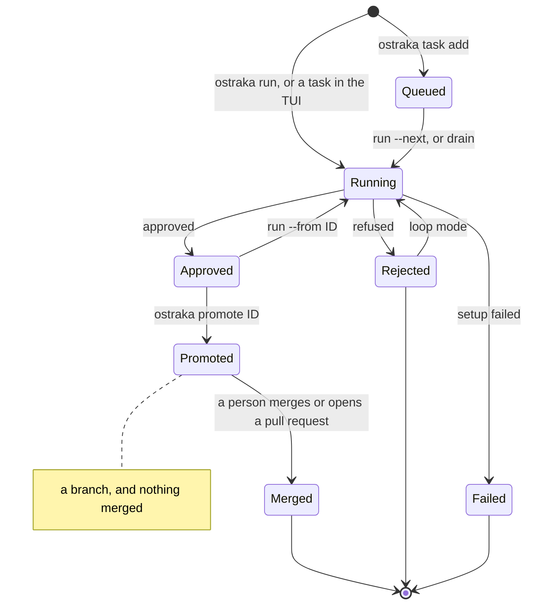
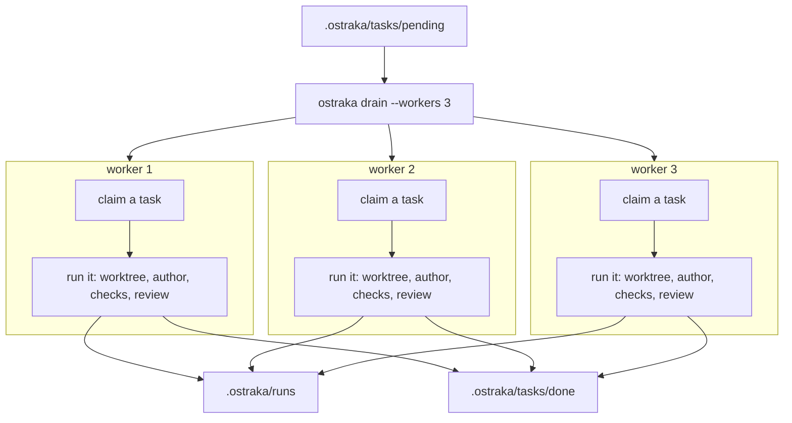
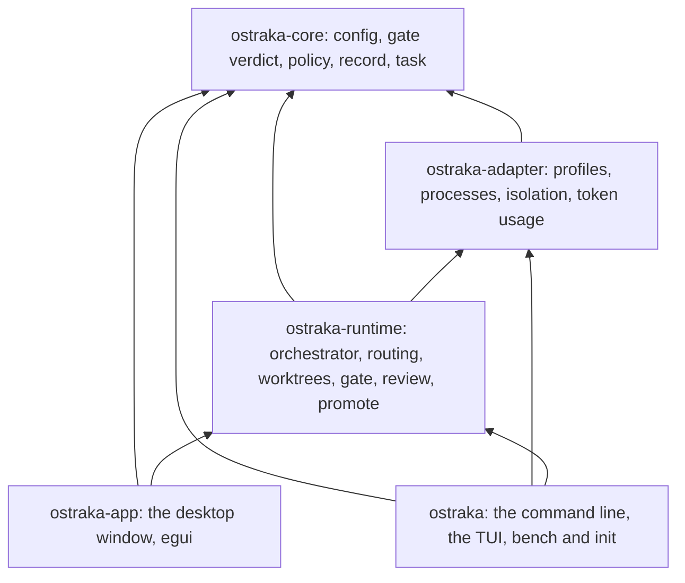

# How Ostraka works

Five diagrams of what the code on `main` does, checked against it rather than
against a plan. They are Mermaid, so GitHub renders them in place.

- [The big picture](#the-big-picture)
- [One run, step by step](#one-run-step-by-step)
- [From task to merged change](#from-task-to-merged-change)
- [Several runs at once](#several-runs-at-once)
- [The crates](#the-crates)

## The big picture

A workspace holds the configuration and everything Ostraka writes. The
repositories it works on are left the way their owners left them: nothing is
written into a repository, and each run works in a worktree of its own.

`ostraka tui` starts a run through the same `run::execute` that `ostraka run`
calls, so a run begun from the browser is the run a shell would begin: the same
routing, gate and record. `ostraka-app` is a second view of the same records.
It lists them, shows a run's checks, events and diff, and promotes an approved
run through the same gate the command line uses. It never starts a run.

Worktrees go under `[worktree] base` in `ostraka.toml`. When that key is absent
it is `.ostraka/worktrees`. The config `ostraka init` writes sets it to
`worktrees`, which puts them in `worktrees/` at the workspace root.

## One run, step by step

The orchestrator drives every step and can approve none of them. Only the gate
can mint a `MergeToken`, and a run ends at a commit on its own branch. Nothing
is merged.

Each `opt` ends the run there. A refused run keeps its worktree, because that is
the evidence somebody needs; `ostraka prune` clears what is left over.

## From task to merged change

A run's record ends in one of three outcomes. `promote` asks the gate again
rather than trusting a stored answer, and stops at a branch: merging is always
a person's act.

- **Approved**: the required checks passed and a profile other than the author
  approved the frozen change. It is a commit on the run's own branch.
- **Refused**, recorded as `rejected`: the author exited non-zero, timed out or
  was stopped; nothing changed; a path fell outside the policy; a required check
  failed; the reviewer said no; or the worktree changed during review. The
  record says which.
- **Setup failed**, recorded as `failed`: the worktree could not be prepared,
  so no agent ran.
- **Continuing** an approved run, with `run --from ID` or the next task in a TUI
  thread, starts from its branch. A refused run is never built on.
- **Promoting** asks the gate again against the current checks, then gives the
  run a branch. It merges nothing.

Loop mode retries a failed check, a rejected change or a run that changed
nothing. It never retries an author that could not run, a run that timed out or
was stopped, or a policy violation, because none of those is about the change.

Asking and planning are not in this picture. They consult one profile through
its read-only invocation, record the answer under `.ostraka/consulted`, and
produce no change, so there is nothing to approve, reject or promote.

## Several runs at once

`ostraka drain --workers N` takes the task list down N at a time. Each worker is
the same sequential run on a thread of its own, with its own worktree and its
own record. Routing picks an author and a reviewer for each task, so different
workers can use different profiles.

Claiming a task renames it from `pending` to `running`. The rename is atomic,
so two workers cannot take the same task, and no lock file is needed. One
Ctrl-C stops every worker; each run can also be stopped on its own.

`ostraka bench` uses the same machinery for comparison: every task in
`.ostraka/bench.toml` crossed with every candidate profile and model, reviewers
held constant, and the results tabulated by what the gate said.

## The crates

Arrows point from a crate to the crates it depends on.

`ostraka-core` does no IO and spawns no processes. No vendor name appears in
`ostraka-adapter` or `ostraka-runtime`: every agent CLI is a TOML profile in
`adapters/`, and adding one is a file, not a release.
